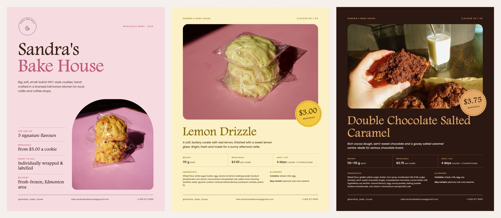
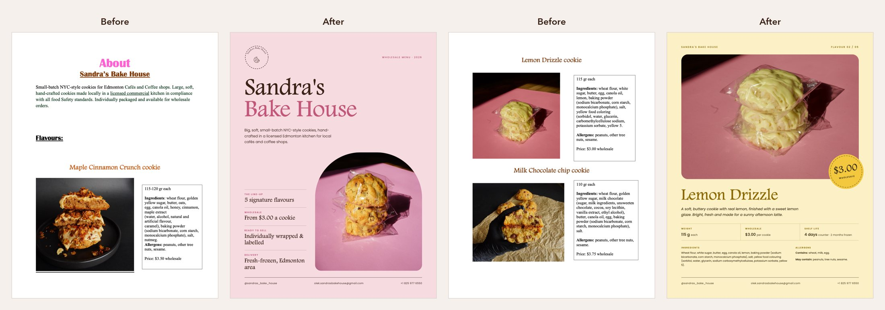
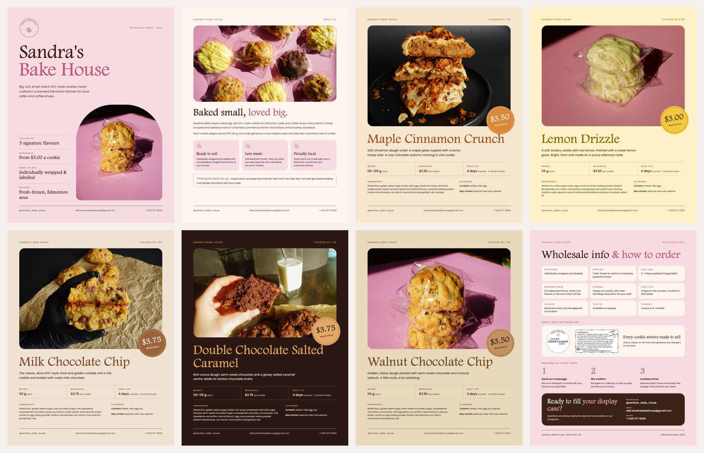
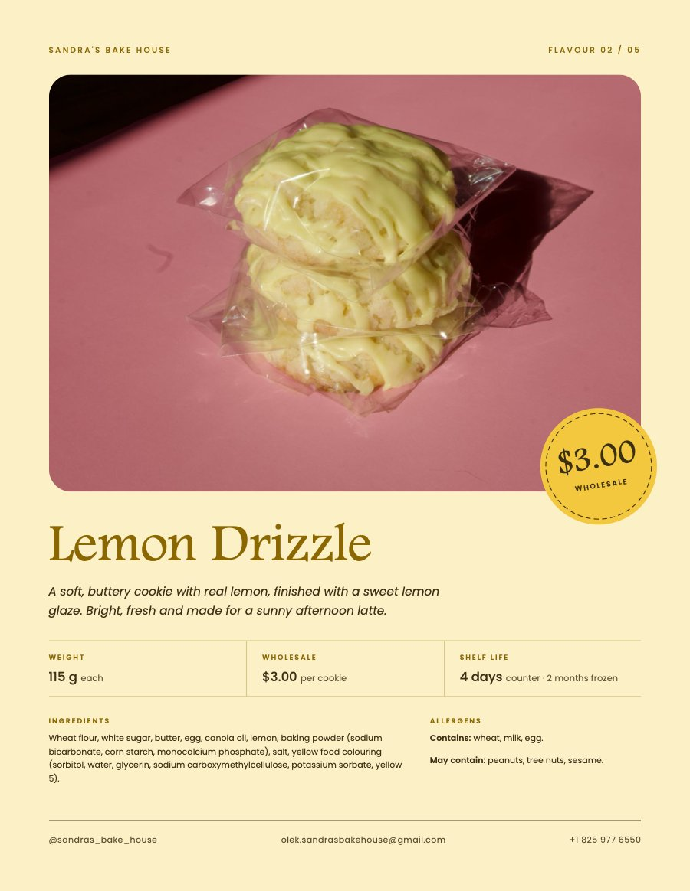
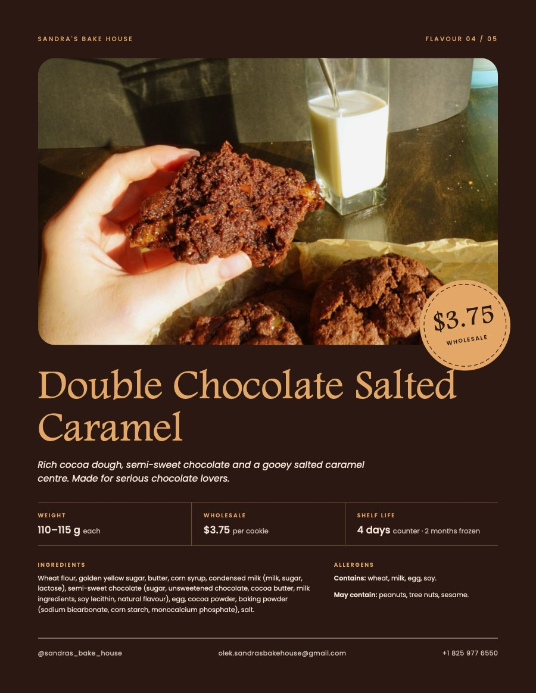
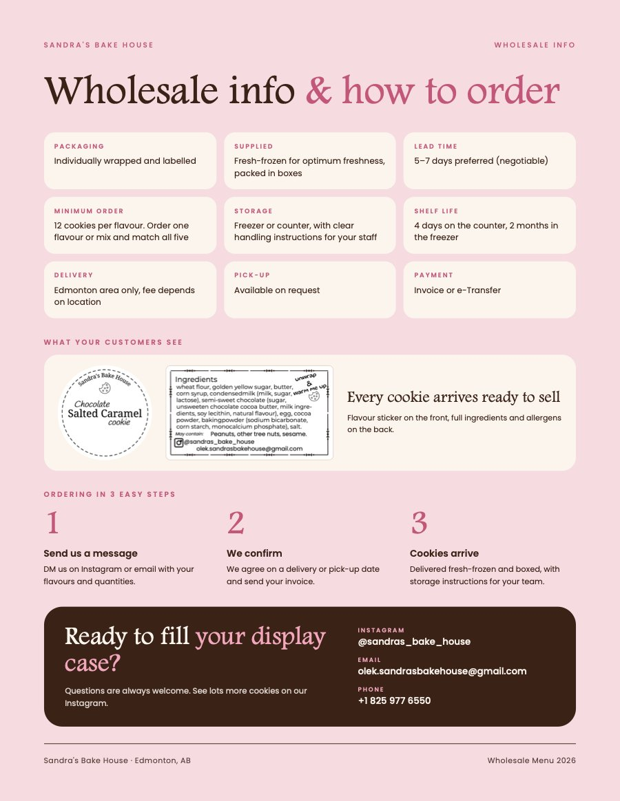

# Sandra's Bake House · Wholesale Catalog

A wholesale PDF catalog for **Sandra's Bake House**, a small-batch NYC-style cookie startup in Edmonton, Alberta. The owner sends it to local cafés by email and Instagram to pitch her cookies for their display cases.

Freelance client project, September 2026. Published with the client's permission.



**[Download the PDF](Sandras-Bake-House-Wholesale-2026.pdf)** · 8 pages · 1.3 MB

---

## The problem

The client made her first catalog herself in Word. The content was solid: great photos, full ingredients, clear wholesale terms. The layout needed work, though: five different fonts, six unrelated colours, and ingredient lists that took up more space than the price. The first word a café owner saw when opening the file was "About".

For a cold email to a business, the catalog *is* the first impression. It needed to look like it came from a real brand.



## My role

I found the client and handled the whole project:

- Audited the original file and presented the problems and a plan
- Designed the layout and visual system
- Built the catalog in HTML/CSS and exported it to PDF
- Went through several rounds of feedback with the client

## Design decisions

- **One page per flavour, themed to the cookie.** Lemon Drizzle sits on butter yellow, Double Chocolate Salted Caramel on dark cocoa, Maple on warm caramel. Every flavour page uses the same template; only the colour theme changes.
- **Kept the client's font.** She chose Footlight MT Light for her flavour names, so it stays as the brand's display font, paired with Poppins (the font on her product labels) for body text.
- **Price and weight first.** A café buyer's first questions are "what is it, how much, how big". The price sits on a round sticker on the photo; ingredients move to a smaller block at the bottom.
- **Bookended in brand colours.** The cover, About and Wholesale pages use the pink and brown from her labels, so the flavour pages read as one catalog.
- **Clear next step.** The last page turns the wholesale terms into a scannable grid, explains ordering in 3 steps and ends with a contact block.



## Content fixes

Beyond the visuals, I caught issues that mattered for a food business:

- **Allergen labelling.** The original listed only the "may contain" allergens (peanuts, tree nuts, sesame) and left out what the cookies actually contain: wheat, milk, egg, soy and, in one flavour, walnuts. Each page now has separate **Contains** and **May contain** lines.
- **Typos** in ingredient names (*sorbidol*, *glucerin*, *unsweeten*) and in the copy.
- Unclear units ("gr", "2 mo") replaced with standard ones.

## Technical problems I solved

| Problem | Cause | Fix |
|---|---|---|
| PDF weighed **13.5 MB**, too big for email | Camera photos stored rotation in EXIF metadata, so Chrome re-encoded them as uncompressed images | Baked the rotation into the pixels with Pillow → **1.3 MB** |
| Grey boxes around the photos and price stickers in macOS Preview | Blurred CSS `box-shadow` is exported as a transparency mask that some PDF viewers draw as a grey rectangle | Removed blurred shadows; every element is now opaque |
| One photo looked too yellow on the dark page | Shot in low evening sun | White-balanced it using the glass of milk in the frame as a neutral reference |
| Chrome would fake a bold for the client's font, which only exists in Light | Headings request weight 600 | Declared the `@font-face` with a weight range of `100 900` |
| My screenshots looked fine but the client saw bugs | I was checking the HTML, not the exported PDF | Switched to rendering the final PDF with macOS PDFKit before every delivery |

<p>
  
  
  
</p>

## Stack

- **HTML + CSS**: each page is a Letter-size block; flavour themes are CSS custom properties
- **Python (Pillow)**: photo resizing, EXIF rotation, colour correction
- **Headless Chrome**: HTML → PDF with embedded fonts and clickable links
- **Claude Code**: AI pair programming for parts of the build

## Build it yourself

```bash
./build.sh
```

Requires Google Chrome on macOS and an internet connection (Poppins loads from Google Fonts). The client's font isn't included for licensing reasons; see [fonts/README.md](fonts/README.md).

## What's next

A website for Sandra's Bake House, built on the same colours and brand, in a separate repository.
